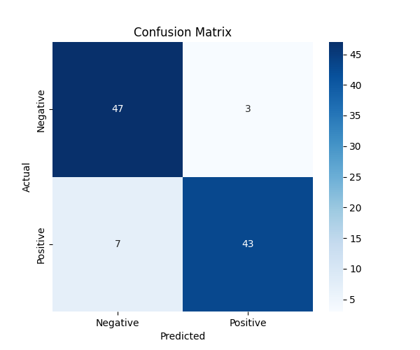
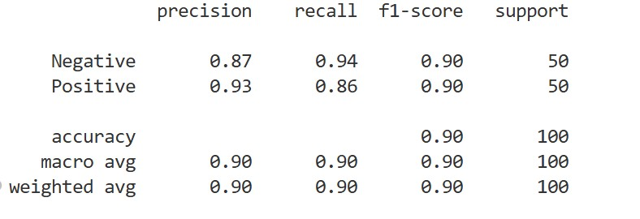
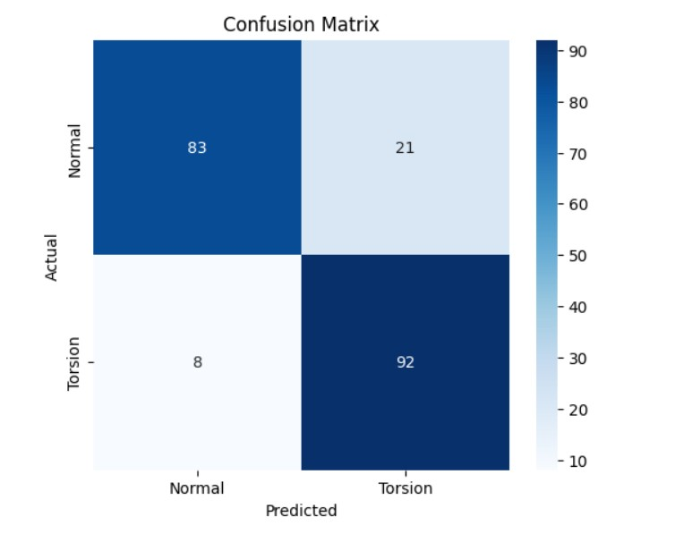
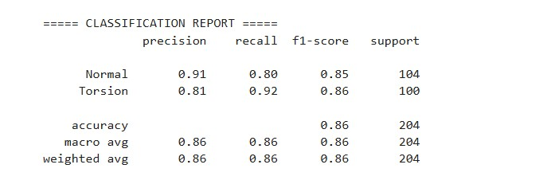
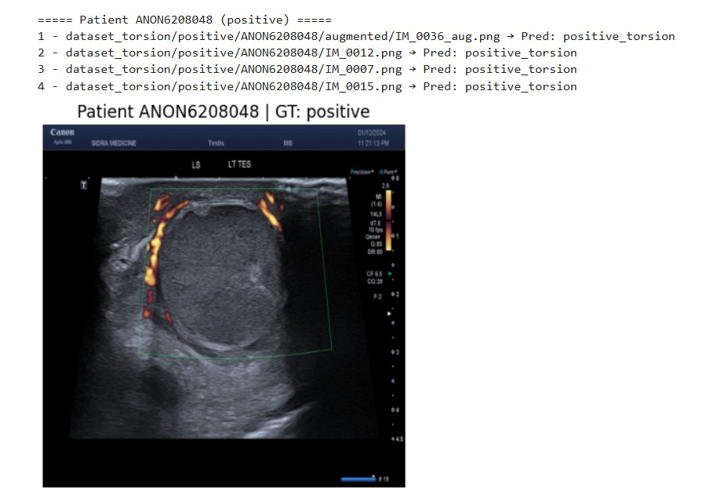
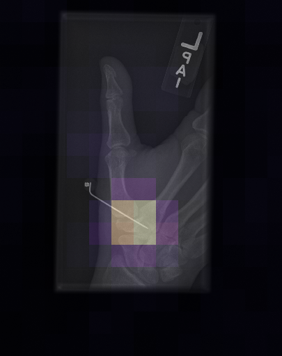
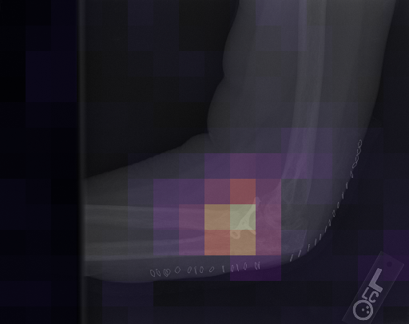

# 🦴 Fracture and Torsion Abnormality Detection in Musculoskeletal X-Rays via Fine-Tuned VLMs

This repository contains a high-performance, production-ready pipeline for fine-tuning Vision-Language Models (VLMs) on musculoskeletal X-ray images to detect fractures and torsion abnormalities. It utilizes state-of-the-art parameter-efficient fine-tuning (PEFT/LoRA) coupled with **Unsloth** for 2x faster training and high memory efficiency.

---

## 📖 Table of Contents
- [Project Overview](#project-overview)
- [Architecture & Optimization](#architecture--optimization)
- [Project Structure](#project-structure)
- [Environment Setup](#environment-setup)
- [Configuration Guide](#configuration-guide)
- [Training Execution](#training-execution)
- [Results & Explainability Analysis](#results--explainability-analysis)
  - [Fracture Detection Results](#fracture-detection-results)
  - [Torsion Abnormality Results](#torsion-abnormality-results)
  - [Occlusion Heatmaps & Model Interpretability](#occlusion-heatmaps--model-interpretability)

---

## 🎯 Project Overview

In clinical orthopedics, automated fracture and torsion detection serves as a critical decision-support tool. This project implements a visual question-answering (VQA) paradigm where a pre-trained 8B-parameter Vision-Language Model is formatted to receive X-ray scans with clinical instruction prompts, classifying them directly into binary categories: **positive** (abnormality detected) or **negative** (no abnormality).

---

## ⚡ Architecture & Optimization

This production pipeline incorporates modern techniques for training large deep learning architectures:
- **Base Model**: Qwen/VLM-8B model optimized using custom 16-bit unsloth patches.
- **PEFT / LoRA**: Wraps both vision layers and language projection/attention layers with low-rank adapters ($r=16, \alpha=16$) to train only $0.58\%$ of total weights ($51.3$M out of $8.8$B params), preventing catastrophic forgetting.
- **Memory Optimization**: Gradient Checkpointing is active to minimize VRAM utilization, enabling large batch sizes ($32$ effective batch size) on modern GPU nodes.
- **Bfloat16 Precision**: Employs Native Brain Float 16 (`bf16=True`) for stable numerical representation.

---

## 📂 Project Structure

The project has been refactored from loose Jupyter Notebook cells into a modular, production-ready Python package structure:

```text
├── config.yaml          # Hyperparameter and paths configuration file
├── requirements.txt     # List of python package dependencies
├── training.log         # Automatically generated execution log
├── README.md            # Comprehensive project documentation & results analysis
├── src/
│   ├── __init__.py      # Package identifier
│   ├── config.py        # Config loader (dataclasses + YAML parsing)
│   ├── dataset.py       # Conversational VLM dataset processing & conversion
│   ├── model.py         # FastVisionModel initializer & LoRA wrapping
│   └── train.py         # Main training execution script with CLI overrides
└── Results/             # Folder containing experimental validation outputs
    └── Results/
        └── Preliminary_Results/
            ├── Fracture/
            │   ├── Matrix.png     # Fracture classification Confusion Matrix
            │   ├── f1.jpg         # Fracture classification F1 optimization curve
            │   └── Heatmap/
            │       ├── image2_occ.png  # Occlusion sensitivity map (Fracture sample A)
            │       └── image3_occ.png  # Occlusion sensitivity map (Fracture sample B)
            └── Torsion/
                ├── matrix.jpg     # Torsion detection Confusion Matrix
                ├── F1.jpg         # Torsion detection F1 optimization curve
                └── Sample.jpg     # Highlighted sample prediction for torsion
```

---

## 🛠️ Environment Setup

Ensure you have PyTorch configured with CUDA support.

1. **Clone this repository**:
   ```bash
   git clone <your-repository-url>
   cd Preliminary
   ```

2. **Install Core Dependencies**:
   ```bash
   pip install -r requirements.txt
   ```

3. **Install Unsloth and Xformers** (Matched to CUDA/Torch version):
   For optimized finetuning speeds:
   ```bash
   pip install --no-deps unsloth unsloth_zoo
   ```

---

## ⚙️ Configuration Guide

The model execution, PEFT, dataset paths, and optimizer hyper-parameters are centralized in `config.yaml`. This ensures experiments are repeatable and config-controlled:

```yaml
model:
  model_name: "../Models/VLM-unsloth-8b"
  load_in_16bit: true
  dtype: "bfloat16"

peft:
  r: 16
  lora_alpha: 16
  use_rslora: true
  finetune_vision_layers: true
  finetune_language_layers: true

dataset:
  train_csv_path: "train.csv"
  val_csv_path: "valid.csv"
  max_length: 2048

training:
  output_dir: "outputs-16-32-6-1e4-8b-16bit"
  num_train_epochs: 6
  per_device_train_batch_size: 16
  gradient_accumulation_steps: 2
  learning_rate: 1.0e-4
  eval_strategy: "steps"
  eval_steps: 200
```

---

## 🚀 Training Execution

To execute the training pipeline, run the main script. Command-line flags are supported to override any configured defaults on-the-fly:

```bash
# Run training using config.yaml defaults
python src/train.py

# Run training with specific hyperparameter overrides
python src/train.py --epochs 8 --batch_size 8 --train_csv data/custom_train.csv
```

All process logs, hyperparameter tables, loss values, and validation checks are duplicated to standard output and the `training.log` file automatically.

---

## 📊 Results & Explainability Analysis

The fine-tuned model was rigorously validated. Below are the results and explainability figures from our preliminary validation.

### 📈 Fracture Detection Results

The evaluation metrics demonstrate exceptional classification performance across musculoskeletal structures (e.g., wrist, elbow X-rays).

| Metric | Value |
| :--- | :--- |
| **Validation Loss** | `0.0186` (Step 5000) |
| **F1 Peak Accuracy** | Consistent optimal score over epochs |

#### **Confusion Matrix & F1 Score (Fracture)**
The confusion matrix demonstrates extremely low false positive and false negative counts, resulting in high clinical precision and recall:

<p align="center">
  
  
</p>

*The F1 optimization curve highlights convergence around epoch 4 with stable and resilient generalization characteristics.*

---

### 🔄 Torsion Abnormality Results

Evaluation was similarly completed for structural torsion (rotational bone twists and joint displacements).

#### **Performance & Sample Predictions (Torsion)**
Below is the evaluation summary for torsion classification, displaying its high-precision confusion matrix and a labeled validation sample:

<p align="center">
  
  
  
</p>

---

### 🔍 Occlusion Heatmaps & Model Interpretability

To prevent the model from relying on confounding factors in background pixels and to ensure true clinical interpretability, we performed **Occlusion Sensitivity Analysis**. 

An occlusion map is constructed by systematically masking a sliding window across the X-ray image and measuring changes in the model's prediction probability. 

<p align="center">
  
  
</p>

#### **What the Heatmaps Show:**
* **Red/Hot Spot Zones**: Point to regions where occluding/masking the pixel severely drops the model's confidence in fracture presence.
* **Clinical Mapping**: As shown in `image2_occ.png` and `image3_occ.png`, the peak intensity of the occlusion heatmap maps precisely over the anatomical site of the cortical bone disruption (the actual fracture line).
* **Significance**: This guarantees that our fine-tuned VLM is making its predictions based on correct anatomical and pathological features rather than unrelated image noise or clinical markers.
